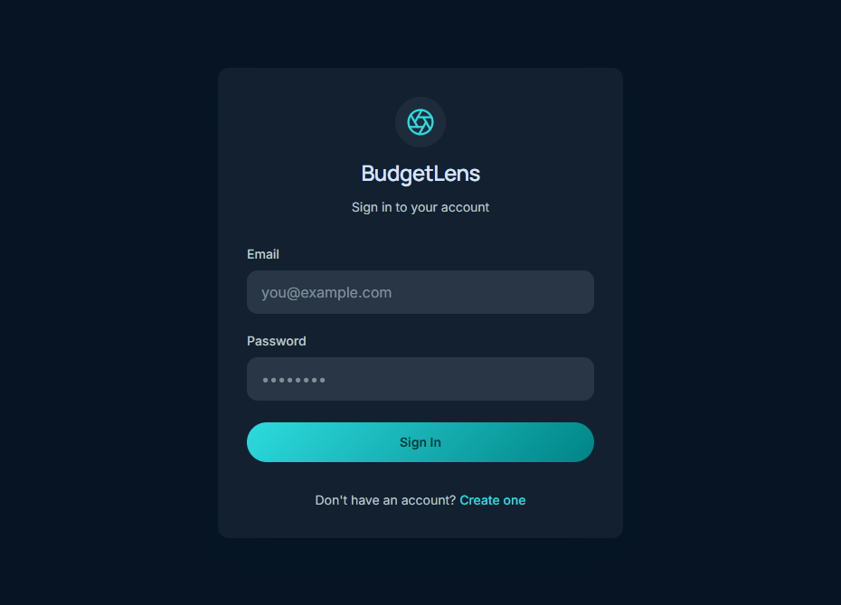
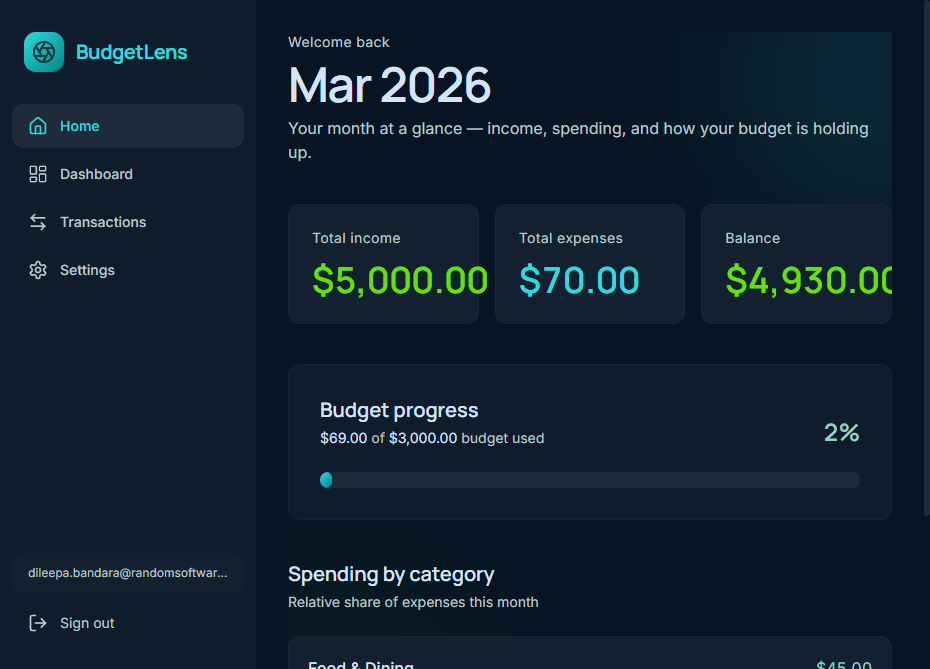
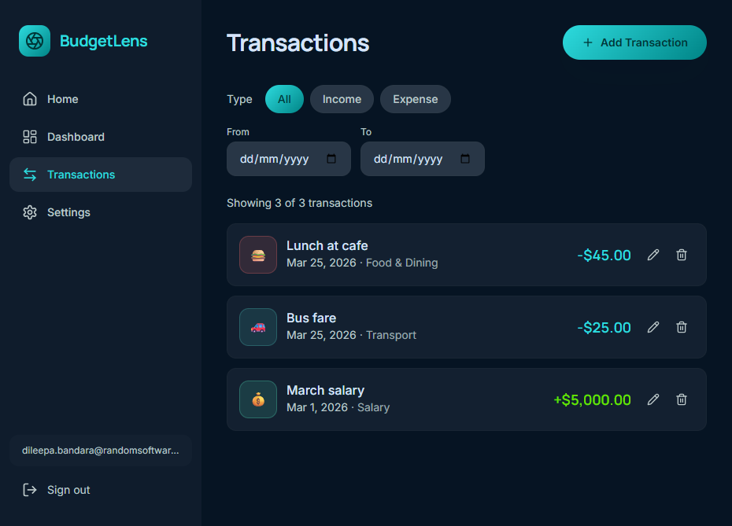
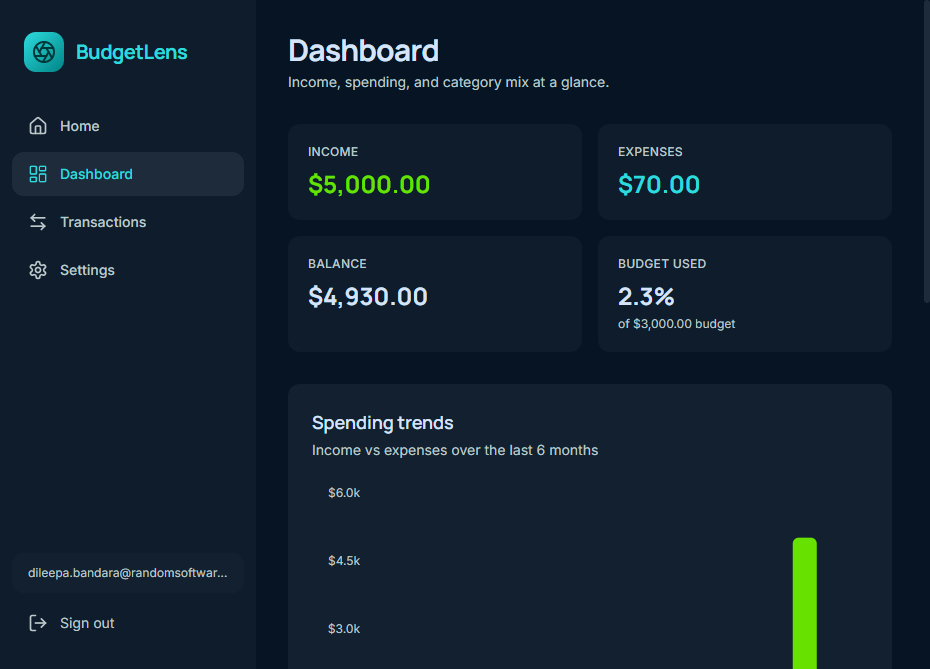
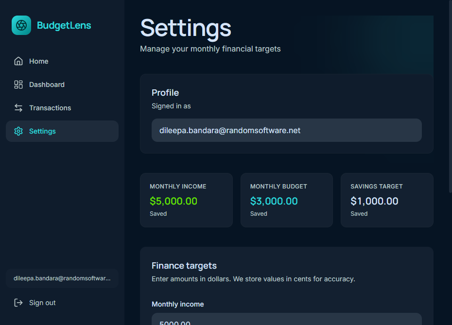
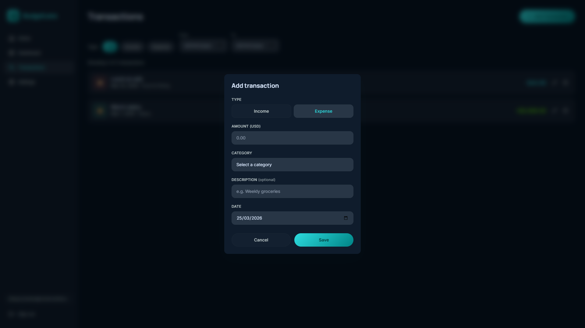

# RSL Mini-Hack '26 — BudgetLens

> **Personal finance tracking** — track income, expenses, budgets, and see where your money goes.

**Monorepo**: `frontend/` (Next.js) + `backend/` (FastAPI), **Supabase**, deployed on **Vercel**.

## Live Demo

| Surface | URL |
| ------- | --- |
| **Web app** | [https://frontend-rho-ten-42.vercel.app](https://frontend-rho-ten-42.vercel.app) |
| **API docs** | [https://backend-chi-wine-55.vercel.app/docs](https://backend-chi-wine-55.vercel.app/docs) |
| **GitHub** | [https://github.com/dileeparsl/budgetlens](https://github.com/dileeparsl/budgetlens) |

## Screenshots

| Login | Home |
|:---:|:---:|
|  |  |

| Transactions | Dashboard |
|:---:|:---:|
|  |  |

| Settings | Add Transaction |
|:---:|:---:|
|  |  |

## Features

- **Auth** — email/password sign-up and login via Supabase Auth
- **Transactions** — full CRUD for income and expenses with categories, dates, and notes
- **Categories** — 10 auto-seeded defaults + custom categories per user
- **Budget targets** — set monthly income, budget, and savings goals
- **Landing page** — month-at-a-glance: total income, expenses, balance, budget progress bar, category breakdown
- **Dashboard** — Recharts bar chart (6-month trends) + donut chart (category mix)
- **Settings** — update financial targets; view profile
- **RLS** — Supabase Row Level Security ensures users only see their own data
- **Responsive** — mobile-friendly dark theme UI (*The Aperture Experience*)

## Tech Stack

| Layer | Choice |
| ----- | ------ |
| Frontend | Next.js 15, TypeScript, Tailwind CSS v4 (`frontend/`) |
| Backend | FastAPI, Pydantic v2 (`backend/`) |
| Database + Auth | Supabase (PostgreSQL + Auth + RLS) |
| Hosting | **Vercel** (both frontend and backend via serverless Python) |
| Charts | Recharts |
| UI/UX | **Google Stitch** — *The Aperture Experience* dark theme |

## Monorepo Layout

```
frontend/          Next.js app — Vercel
backend/           FastAPI API — Vercel (serverless Python)
docs/              Architecture, design system, AI workflow, use case
backend/sql/       Supabase schema (tables, RLS, triggers)
.env.example       Template for both packages
```

## Quick Start (Local)

### 1. Supabase

Create a project at [supabase.com](https://supabase.com). Run `backend/sql/schema.sql` in the SQL Editor. Note the project URL and anon key.

### 2. Frontend

```bash
cd frontend
npm install
cp .env.local.example .env.local
# Edit .env.local — set NEXT_PUBLIC_SUPABASE_URL, NEXT_PUBLIC_SUPABASE_ANON_KEY
# Set NEXT_PUBLIC_API_URL=http://localhost:8000
npm run dev
```

### 3. Backend

```bash
cd backend
python -m venv .venv && .venv\Scripts\activate  # or source .venv/bin/activate
pip install -r requirements.txt
cp .env.example .env
# Edit .env — set SUPABASE_URL, SUPABASE_ANON_KEY, CORS_ORIGINS
uvicorn app.main:app --reload --port 8000
```

Open the app at [http://localhost:3000](http://localhost:3000) and API docs at [http://localhost:8000/docs](http://localhost:8000/docs).

## Environment Variables

### Frontend (`frontend/.env.local`)

| Variable | Description |
| -------- | ----------- |
| `NEXT_PUBLIC_SUPABASE_URL` | Supabase project URL |
| `NEXT_PUBLIC_SUPABASE_ANON_KEY` | Supabase anon (public) key |
| `NEXT_PUBLIC_API_URL` | FastAPI base URL (no trailing slash) |

### Backend (`backend/.env`)

| Variable | Description |
| -------- | ----------- |
| `SUPABASE_URL` | Supabase project URL |
| `SUPABASE_ANON_KEY` | Supabase anon (public) key |
| `CORS_ORIGINS` | Comma-separated allowed origins |

## API Endpoints

| Method | Route | Purpose |
| ------ | ----- | ------- |
| GET | `/health` | Health check |
| GET, POST | `/api/categories` | List (auto-seeds defaults) / Create |
| GET, PUT, DELETE | `/api/categories/{id}` | Read / Update / Delete |
| GET, POST | `/api/transactions` | List (filter + paginate) / Create |
| GET, PUT, DELETE | `/api/transactions/{id}` | Read / Update / Delete |
| GET, PUT | `/api/finance-settings` | Read (auto-creates) / Upsert |
| GET | `/api/summary/monthly` | Month totals, budget %, category breakdown |
| GET | `/api/summary/dashboard` | Current month + N-month trends |

All money values are stored as **integer cents**. Every route enforces user scope via Supabase JWT + RLS.

## Architecture

See [docs/architecture.md](docs/architecture.md) for the full ADR.

```
Browser ←→ Next.js (Vercel) → FastAPI (Vercel serverless) ←→ Supabase (Postgres + Auth)
```

- Frontend uses Supabase Auth for login/signup (session in browser)
- Frontend sends Bearer token to FastAPI on every API call
- FastAPI verifies tokens via `supabase.auth.get_user(token)` and forwards JWT to PostgREST for RLS

## Design System

[docs/DESIGN.md](docs/DESIGN.md) — *The Aperture Experience* from **Google Stitch**.

Dark teal surfaces, glassmorphism, gradient CTAs, Manrope + Inter typography, no borders (tonal shifts only), Focal Chart colors for financial data.

## AI Workflow (Hackathon Deliverable)

[docs/ai-workflow.md](docs/ai-workflow.md)

## Deploy

Both packages deploy to **Vercel**:

- **Frontend**: `cd frontend && vercel --prod --yes` (Root Directory = `frontend`)
- **Backend**: `cd backend && vercel --prod --yes` (uses `vercel.json` + `api/index.py` serverless entry)

Set environment variables in Vercel dashboard for each project. Update `CORS_ORIGINS` on the backend to include the frontend production URL.

## License

MIT
