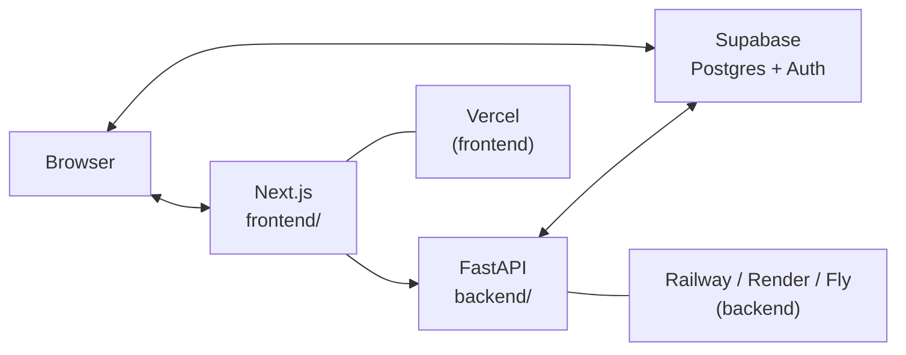

# Architecture Decision Record

## Use case

### Brief

**RSL Mini-Hack '26 (March 25, 2026): personal finance tracking.**

Full brief: [docs/use-case.md](use-case.md).

### MVP scope for 90 minutes

- Auth (**Supabase Auth** — email/password is fastest).
- **Categories** per user (defaults + custom).
- **Transactions**: income/expense, amount, date, category, note.
- **Settings**: monthly income, monthly budget, savings target.
- **Landing (`/`)** — Month summary, budget % used, category breakdown.
- **`/dashboard`** — Charts (e.g. Recharts): spending over time, category mix.
- **Mobile-first** responsive layout.

**Optional**: insight cards, NL query — only if deploy is not blocked.

## System architecture (monorepo)

- Next.js talks to **Supabase** for auth session in the browser.
- Next.js calls **FastAPI** for domain REST operations (with Bearer token from Supabase where required).
- FastAPI validates JWT and accesses Postgres via Supabase client or PostgREST (RLS aligned with `auth.uid()`).

## Tech stack

| Layer | Choice | Reason |
| ----- | ------ | ------ |
| Frontend | Next.js + React in `frontend/` | SSR, fast UI iteration, Vercel-native |
| Styling | Tailwind + shadcn/ui | Accessible UI, speed |
| Backend | FastAPI in `backend/` | Clear REST + OpenAPI, Python ecosystem |
| Database | Supabase Postgres | Free tier, auth, RLS |
| Auth | Supabase Auth | JWT for API; session in Next.js |
| Frontend hosting | Vercel | Git deploy, Next.js optimized |
| API hosting | Railway / Render / Fly | ASGI-friendly, separate from Vercel |
| UI/UX | Google Stitch + Figma | Exploration + handoff; **`docs/DESIGN.md`** (*Aperture Experience*) is the coded spec |
| Charts | Recharts (in Next.js) | React-friendly |

## Data model (conceptual)

Unchanged from Postgres perspective — see previous ERD: `profiles`, `categories`,
`transactions`, `finance_settings`; money as **integer cents**; `type` on
transactions: `income` | `expense`.

## API (FastAPI) — suggested

Expose under a prefix e.g. `/api` or versioned paths; document at `/docs`.

| Method | Route | Purpose |
| ------ | ----- | ------- |
| GET, POST | /api/categories | List / create |
| GET, PUT, DELETE | /api/categories/{id} | Read / update / delete |
| GET, POST | /api/transactions | List / create |
| GET, PUT, DELETE | /api/transactions/{id} | Read / update / delete |
| GET, PUT | /api/finance-settings | Read / upsert |

Use **Pydantic** on bodies; enforce user scope from JWT on every route.

## Next.js page routes (suggested)

| Route | Purpose |
| ----- | ------- |
| / | Landing |
| /login, /signup | Auth |
| /dashboard | Charts |
| /transactions | CRUD UI |
| /categories | Manage categories |
| /settings | Budget / income / savings targets |

## Security

- **RLS** on all user tables; policies for `auth.uid()`.
- **Service role** only on `backend/` server env — never in Next.js client bundle.
- **CORS** on FastAPI: allow local dev + Vercel production origin only.

## Contract between packages

- **Source of truth**: FastAPI OpenAPI (`/openapi.json`).
- Mirror DTOs in `frontend` TypeScript types; update together when the API changes.
