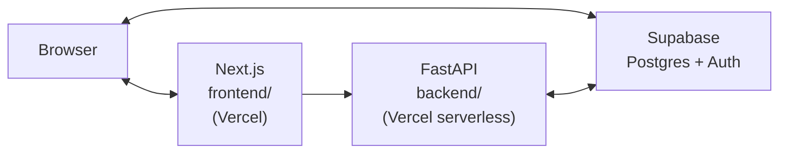

# Architecture Decision Record

## Use Case

### Brief

**RSL Mini-Hack '26 (March 25, 2026): personal finance tracking.**

Full brief: [docs/use-case.md](use-case.md).

### MVP Scope (90 minutes)

- Auth (**Supabase Auth** — email/password).
- **Categories** per user (10 defaults auto-seeded + custom).
- **Transactions**: income/expense, amount (integer cents), date, category, note.
- **Settings**: monthly income, monthly budget, savings target.
- **Landing (`/`)** — Month summary, budget % used, category breakdown.
- **`/dashboard`** — Charts (Recharts): 6-month spending trends, category mix donut.
- **Mobile-first** responsive dark theme.

## System Architecture (Monorepo)



### Data Flow

1. **Browser** signs up / logs in via **Supabase Auth** (hosted UI or client SDK) — gets a JWT session.
2. **Next.js** sends `Authorization: Bearer <access_token>` to **FastAPI** for all domain operations.
3. **FastAPI** verifies the JWT by calling `supabase.auth.get_user(token)` — no local JWT secret needed.
4. For data queries, FastAPI creates a **per-request Supabase client** with `postgrest.auth(token)`, so PostgREST sees `auth.uid()` and **RLS policies** scope rows to the current user.

## Deployed URLs

| Surface | URL |
| ------- | --- |
| **Frontend** (Next.js) | [https://frontend-rho-ten-42.vercel.app](https://frontend-rho-ten-42.vercel.app) |
| **Backend** (FastAPI API docs) | [https://backend-chi-wine-55.vercel.app/docs](https://backend-chi-wine-55.vercel.app/docs) |
| **GitHub** | [https://github.com/dileeparsl/budgetlens](https://github.com/dileeparsl/budgetlens) |

## Tech Stack

| Layer | Choice | Reason |
| ----- | ------ | ------ |
| Frontend | Next.js 15 + React in `frontend/` | SSR, fast UI iteration, Vercel-native |
| Styling | Tailwind CSS v4, Aperture tokens | Dark theme design system from Stitch |
| Backend | FastAPI in `backend/` | Clear REST + OpenAPI, Python |
| Database | Supabase Postgres | Free tier, auth, RLS |
| Auth | Supabase Auth (anon key) | JWT for API; session in browser |
| Hosting | Vercel (both packages) | Frontend: Next.js; Backend: serverless Python |
| UI/UX | Google Stitch | *The Aperture Experience* — [`docs/DESIGN.md`](DESIGN.md) |
| Charts | Recharts | React-friendly bar + donut charts |

## Data Model

Tables live in Supabase Postgres (schema: `backend/sql/schema.sql`).

| Table | Key columns | Notes |
| ----- | ----------- | ----- |
| `categories` | `id`, `user_id`, `name`, `icon`, `color`, `is_default` | 10 defaults auto-seeded per user |
| `transactions` | `id`, `user_id`, `amount_cents`, `type`, `category_id`, `date`, `description` | `type` = `income` or `expense`; money as integer cents |
| `finance_settings` | `id`, `user_id`, `monthly_income_cents`, `monthly_budget_cents`, `savings_target_cents` | One row per user, auto-created on first GET |

All tables have RLS: `auth.uid() = user_id`.

## API (FastAPI)

All routes under `/api/`. Interactive docs at `/docs`.

| Method | Route | Purpose |
| ------ | ----- | ------- |
| GET | `/health` | Health check |
| GET, POST | `/api/categories` | List (auto-seeds) / Create |
| GET, PUT, DELETE | `/api/categories/{id}` | Read / Update / Delete |
| GET, POST | `/api/transactions` | List (filter + paginate) / Create |
| GET, PUT, DELETE | `/api/transactions/{id}` | Read / Update / Delete |
| GET, PUT | `/api/finance-settings` | Read (auto-creates) / Upsert |
| GET | `/api/summary/monthly` | Month totals, budget %, categories |
| GET | `/api/summary/dashboard` | Current month + N-month trends |

### Authentication Pattern

```
auth.py: get_current_user_id()
  → HTTPBearer extracts token
  → supabase.auth.get_user(token) verifies with Supabase
  → returns user.id (UUID)

database.py: get_supabase_for_user()
  → creates per-request Supabase client
  → calls postgrest.auth(token) so RLS sees auth.uid()
```

No service-role key or local JWT secret needed.

## Next.js Pages

| Route | Purpose |
| ----- | ------- |
| `/login` | Sign in |
| `/signup` | Create account |
| `/` | Landing — month summary, budget bar, category breakdown |
| `/dashboard` | Charts — 6-month trends + category donut |
| `/transactions` | CRUD with filters |
| `/settings` | Budget / income / savings targets |

## Security

- **RLS** on all user tables; policies enforce `auth.uid() = user_id`
- **Anon key only** on both frontend and backend — no service-role key anywhere
- **CORS** on FastAPI: allows local dev + Vercel production origin
- **JWT forwarding** — user's own token used for all PostgREST queries

## Contract Between Packages

- **Source of truth**: FastAPI OpenAPI (`/openapi.json`)
- TypeScript types in `frontend/src/types/index.ts` mirror Pydantic models
- Frontend sends `Authorization: Bearer <token>` with every API request
